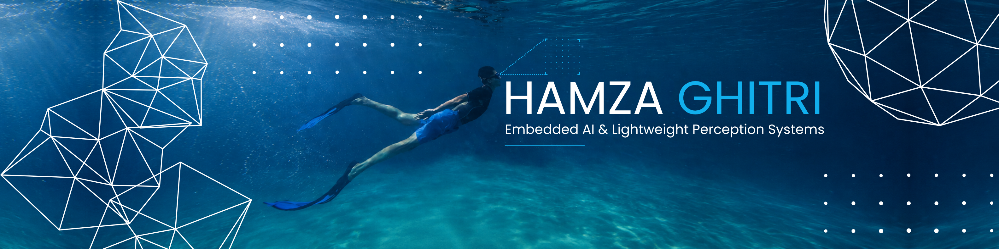
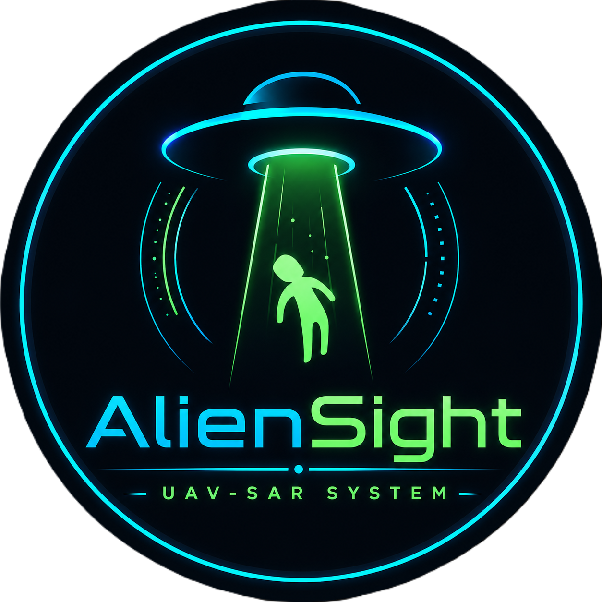

  

<h1 align="center">Hamza Ghitri</h1>

<h3 align="center">
Embedded AI & Computer Vision Researcher
</h3>

Lightweight Robotic Perception · Edge AI Deployment · Underwater & Aerial Inspection Systems

  <a href="https://github.com/7amzaGH">GitHub</a> ·
  <a href="https://www.linkedin.com/in/hamza-ghitri">LinkedIn</a> ·
  <a href="https://orcid.org/0009-0000-2021-8523">ORCID</a>

---

## About Me

I am an AI researcher with a Master's degree in **Cybersecurity and Artificial Intelligence**, specializing in **embedded AI, computer vision, and robotic perception** for resource-constrained autonomous systems.

My work focuses on extracting meaningful geometric and environmental information from visual data in challenging real-world environments, especially in **underwater inspection** and **UAV-based search-and-rescue** scenarios.

I am particularly interested in:

- Lightweight perception systems for robotics
- Embedded AI and real-time inference
- Underwater and aerial robotic inspection
- Computer vision for localization, navigation, and scene understanding
- Geometry-based perception and resource-aware AI deployment

---

## Current Research Focus

I am currently building research-oriented AI systems that connect **computer vision models** with **practical robotic deployment**.

My main direction is:

> Designing lightweight perception frameworks that allow robots to understand complex environments using efficient visual AI models, geometric reasoning, and embedded deployment strategies.

This includes underwater pipeline inspection, bubble plume analysis, gas leak segmentation, UAV human detection, and monocular geolocation.

---

## Technical Skills

### Programming & Development

  
  
  
  

### Machine Learning & Computer Vision

  
  
  
  
  

### Embedded AI & Robotics Perception

  
  
  
  
  

### Research & Tools

  
  
  
  
  

---

## Main Research Projects

<table>
<tr>
<td width="50%" align="center">

### NeptuNet

**Lightweight Underwater Perception Framework**

NeptuNet is a research-oriented embedded AI framework for underwater gas pipeline inspection.  
It integrates pipeline perception, bubble plume analysis, gas leak segmentation, geometric information extraction, and deployment-aware system design.

**Focus:** Underwater Robotics · Embedded AI · Computer Vision · Gas Pipeline Inspection

<a href="https://github.com/7amzaGH/NeptuNet-AUV-Intelligent-System">
  <b>View Repository</b>
</a>

</td>

<td width="50%" align="center">

### AlienSight

**Lightweight UAV Perception and Geolocation System**

AlienSight is a UAV-based perception system for search-and-rescue scenarios.  
It combines lightweight human detection, monocular geolocation, telemetry-based reasoning, and automated alert generation for aerial robotic intelligence.

**Focus:** UAV Perception · Search and Rescue · Human Detection · Geolocation

<a href="https://github.com/7amzaGH/UAV-SAR-Human-Detection-and-Geolocation">
  <b>View Repository</b>
</a>

</td>
</tr>
</table>

---

## Research Works

### Underwater Robotic Perception

- **Lightweight Underwater Pipeline Geometric Perception for Embedded AI Deployment**  
  Manuscript prepared for EDiS 2026.

- **Real-Time Embedded Underwater Gas Leak Segmentation Using Physics-Guided Plume Representation**  
  Manuscript under review.

- **Explainable Physics-Inspired Bubble Plume Analysis for Real-Time Underwater Gas Leak Detection**  
  Manuscript under review.

- **NeptuNet: A Lightweight Vision-Based AUV Perception System for Subsea Gas Pipeline Inspection**  
  System-level research work.

### UAV-Based Robotic Perception

- **Lightweight End-to-End Human Detection and Geolocation from UAV Imagery for Search-and-Rescue**  
  System-level research work.

---

## Research Interests

  
  
  
  
  
  

---

## Profile Summary

I aim to build AI systems that are not only accurate, but also lightweight, explainable, and deployable on real robotic platforms.

My long-term research goal is to contribute to **resource-aware robotic perception systems** capable of supporting autonomous inspection, environmental monitoring, and field robotics in challenging environments.
